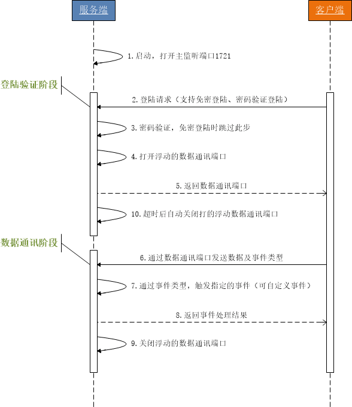

# hy.common.net





服务端配置举例
```xml
<?xml version="1.0" encoding="UTF-8"?>

<config>

	<import name="xconfig"         class="java.util.ArrayList" />
	<import name="server"          class="org.hy.common.net.ServerSocket" />
	
	
	
	<!-- 系统服务配置信息 -->
	<xconfig>
	
		<server id="Server">
			<port>1721</port>               <!-- 服务端监听主端口 -->
			<minPort>17000</minPort>        <!-- 数据通讯的浮动端口的最小值 -->
			<maxPort>17999</maxPort>        <!-- 数据通讯的浮动端口的最大值 -->
			<closeTimeout>60</closeTimeout> <!-- 数据通讯的浮动端口的自动关闭超时时长（单位：秒） -->
			<log>false</log>                <!-- 是否显示通讯日志 -->
			
			<!-- 自定义服务端登陆验证接口。可选的，当没有定义验证方法时，免登陆 -->
			<validate class="org.hy.demo.ServerValidate" />
			
			<call name="addListener">       <!-- 添加自定义通讯事件 -->
				<listener class="org.hy.demo.ServerDemo" />
			</call>
			
			<call name="open" />            <!-- 打开监听主端号服务 -->
		</server>
		
	</xconfig>
	
</config>
```


客户端访问举例
```java
    Map<String ,Object> v_DataMap = new HashMap<String ,Object>();
    v_DataMap.put("String"  ,"ABCDEFG");
    v_DataMap.put("Integer" ,1234567890);
    v_DataMap.put("Date"    ,new Date());

    
    CommunicationRequest  v_RequestData  = new CommunicationRequest();
    CommunicationResponse v_ResponseData = null;
    List<String>          v_Results      = null;
    
    v_RequestData.setEventType("Demo");                // 通讯的事件类型。如果没有设置此属性，默认为XJava事件类型
    v_RequestData.setDataXID(  "2017");                // 通讯数据的标识ID。可选的，按具体业务而定
    v_RequestData.setData(      i_DataMap);            // 通讯数据。可选的，按具体业务而定。可为任何Java类型，须实现 java.io.Serializable 接口
	
    ClientSocket v_Client = new ClientSocket("服务端IP" ,1721);
	
    v_Client.setValidate(new ClientValidate());        // 如果服务端启用了登陆验证，则客户端要提供用户名及密码
	
    v_ResponseData = v_Client.send(v_RequestData);     // 发送通讯数据
	
    v_Results = (List<String>)v_ResponseData.getData();// 获取服务端的返回结果。可为任何Java类型，只须实现 java.io.Serializable 接口即可
```


---
演示项目 https://github.com/HY-ZhengWei/CommunicationEventDemo

单点登陆服务案例 https://github.com/HY-ZhengWei/XSSO

集群管理案例 https://github.com/HY-ZhengWei/LogWeb


---
#### 本项目引用Jar包，其源码链接如下
引用 https://github.com/HY-ZhengWei/hy.common.base 类库

引用 https://github.com/HY-ZhengWei/hy.common.file 类库